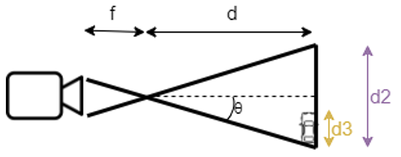
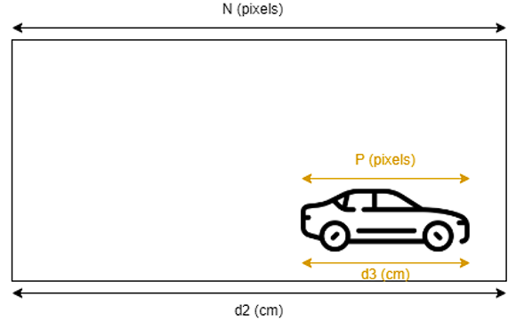
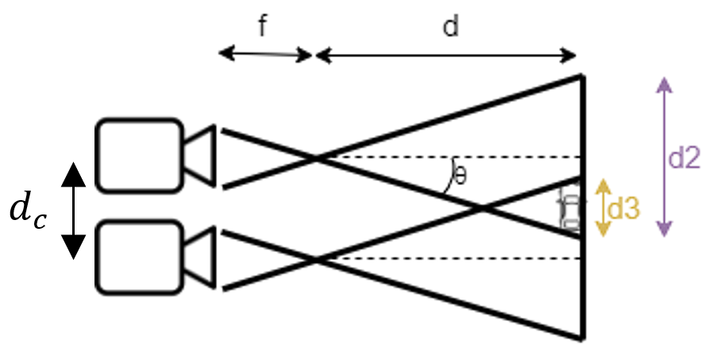
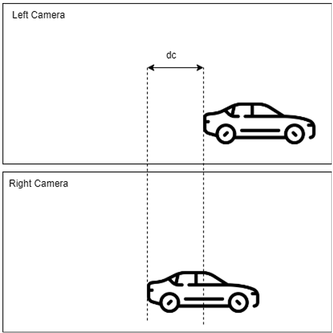

# The Implementation of Distance Estimation Algorithm on an ESP32-CAM-based Stereo Camera
> This repository is used to store files and documentations related to the Distance Estimation Algorithm (DEA) project.

### External Links
- [Distance Estimation Algorithm (DEA) Project Report](https://drive.google.com/file/d/1stVMjWo_e8pQuYwJr5704dwE-qUeXETI/view?usp=sharing)
- [Product Introduction and Demonstration Video](https://drive.google.com/file/d/1KExDEG55TohjloNicQDEpm_vvVpYXwp8/view?usp=sharing)

### Authors
- Daven Darmawan Sendjaya (13221062@mahasiswa.itb.ac.id)
- Danish Muhammad Hafidz (13221080@mahasiswa.itb.ac.id)

### Brief Description
**Distance Estimation Algorithm (DEA)** is an algorithm that can be used to estimate distances of several objects from a certain point. The distances are calculated by using the concept of geometry and trigonometry, with the help of object detection algorithms.

On this project, we had to use two ESP32-CAMs that were placed parallelly on a wooden board. The distance between both camera was measured to be 14.5 cms. These two cameras served as the stereo camera on this project.

In order to calculate object distances relative to the cameras, it was needed to find the ratio of pixel differences between the image width and the object widths. This ratio was then used to estimate the distance. Object width could be calculated by using an object detection algorithm to draw bounding boxes around the designated object, and to calculate its width based on the coordinates of the bounding box (in pixels). On this project, we used YOLO (*You Only Look Once*) algorithm to run the object detection. 

### Geometry in Detail
In order to understand how the system work, we need to understand the geometry concept of the Stereo Camera.

#### Single Camera Concept
<p align="center">

</p>

Based on the Single Camera image above, it is inferred that the distance of the object (car) relative to the camera is,

```math
distance = f + d
```

with $f$ as the focal length (distance between the point of convergence of the lens and the sensor) and $d$ as the distance between the tip of focal length and the object.

If we have the angle $\theta$ on the image above, we are able to acquire the value of $\tan{\theta}$ and $d$ as follows,

```math
\tan \theta = \frac{d_2}{2d}
```

```math
d = \frac{d_2}{2\tan\theta}
```

#### Projection of Single Camera's Viewpoint
<p align="center">

</p>

If we project the camera's viewpoint (across the vertical line of $d_2$) onto a screen, we are able to get the properties of the image acquired by the camera.

An image acquired by the camera has width and length properties described in pixels. Each pixels of the image is used to determine the light intensity and color of each picture grids, which are aligned to build a complete picture. The image has $N$ pixels width.

On the other hand, the object detection system are able to estimate the width of object (in $P$ pixels). These pixels can be used to acquire real object distance (in meters or centimeters) by the concept of congruence.

As $N$ (in pixels) can be mapped to $d_2$ (in cms) and $P$ (in pixels) can be mapped to $d_3$ (in cms), the object distance (in cms) can be calculated by using the following formula,

```math
\frac{d_3}{d_2} = \frac{P}{N} 
```

```math
d_2=\frac{Nd_3}{P} 
```

Using the distance formula on the previous section, we are able to calculate the object distance by,

```math
distance = \frac{Nd_3}{2P\tanθ} + f  
```

But on this section, several variables are still unknown, such as $d_3$, $\theta$ and $f$.

#### Stereo Camera Concept
<p align="center">



</p>

If we add a second camera, we are able to calculate the variable $d_3$ based on both camera viewpoints.

Based on the pictures above, $d_c$ is the distance between two cameras. On the camera viewpoints, we can see that the object is placed on a different points if viewed from different cameras (left or right camera). The difference between two points is $d_c$.

Based on the fact above, we are able to find the formula for the object distance as follows,

```math
distance = \frac{Nd_c}{2P\tanθ} + f  
```

On this section, several variables are still unknown, such as $\theta$ and $f$. Both variables can be acquired by callibration. The callibration procedure is done through setting an object on a certain measured distance from the camera, and then plugging in all the variables into the formula above.

Therefore, $\theta$ and $f$ by using the system of linear equations.

### Folder Information
Every source codes can be accessed under the `Source Codes` folder. The `Source Codes` folder contains more additional folders which are named according to the function of every source codes.

The folders are as follows,
- Folder `Distance Estimation Algorithm (DEA)`: Main program which is used to fetch images from two ESP32-CAMs and predict the object class based on the YOLO model. The distance is also calculated using this source code (implementing the formulas described above).
- Folder `esp32_webcam`: Source code to implement Camera Web Server on every ESP32-CAMs used as the stereo camera. This source code prints a server address to the serial monitor that can be used to fetch the images acquired by both ESP32 cameras.

> Thank you for Mr. Rui Santos for providing the  Camera Web Server code for ESP32-CAM. Please also check out other ESP32-CAM projects of Mr. Rui Santos through this link,
>
> https://randomnerdtutorials.com/esp32-cam-projects-ebook/
